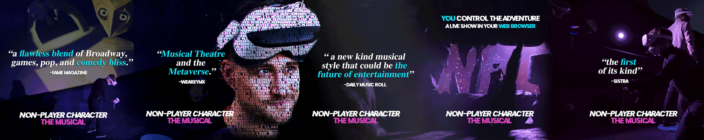

## Request Interview / Press Pass
We welcome all coverage of *Non-Player Character*. Please contact *brendanAbradley (at) gmail (dot) com* for media requests and/or complimentary/private performances. Below please find approved press materials and pull quotes. Thank you! 

  
  
## *Non-Player Character* in the Press 
Imagine if a Disney musical came to life and interacted with audiences in what [Fame Magazine](https://www.famemagazine.co.uk/brendan-bradleys-reprogram-me-a-dream-pop-immersive-experience-between-vr-and-live-theater/) calls,
> *“a dream-pop immersive experience between VR and live theater… a flawless blend of Broadway, games, pop, and comedy bliss.”*

[*Non-Player Character*](https://music.apple.com/album/1634852775?app=itunes), written and performed by Brendan Bradley is a live, virtual reality stage show about a non-player character in a video game who witnesses the death of the Hero and turns to the audience to navigate the five stages of grief (represented as five virtual worlds). Techincal Direction is provided by Michael Morran while the show's music and soundtrack are arranged and produced by Maurice Soque Jr (who co-wrote the music with Bradley). 

[Plastic Magazine](https://plasticmag.co.uk/2022/07/25/new-music-from-brendan-bradley/) explains 
> *“Blending ingredients of pop music, video games, broadway and comedy into his new pioneering spectacle, Brendan Bradley has brought to life a show that would have seemed impossible to create only a couple of years ago,”*

with [Dancing About Architecture](https://dancing-about-architecture.com/heros-welcome-brendan-bradley-reviewed-by-dave-franklin/) adding, 
> *“it isn’t often that something comes along that is so revolutionary that it blurs the lines between mediums. But that is the charge that Brendan Bradley is leading… buoyant and full of life, sitting somewhere between a Disney production, a choose-your-own-adventure experience and an IT helpline, both tongue-in-cheek and informative, and peppered with plenty of knowing winks and in-jokes for the gamers in the audience.”*

In a solo, hybrid performance called *“punchy and powerful”* by [TJPL News](https://www.tjplnews.com/post/who-s-ya-favourite-chart-dance-pop-22-07-2022) and *“full of attitude and innovation”* according to [Indie o’clock](http://indiedockmusicblog.co.uk/?p=13991), 
> *“Bradley plays various characters inside a fictional video game, pioneering a new kind musical style that could be the future of entertainment,”* reports [Daily Music Roll](https://www.dailymusicroll.com/entertainment/listen-to-the-future-of-musicals-with-the-virtual-reality-track-reprogram-me-by-brendan-bradley.html), *“incorporating danceable beats and catchy electro-pop soundscapes…with an auto-tuned tremolo offering the virtual soul of Bradley’s characters in the vein of Owl City, Bo Burnham, and Wall-E.* 

 [WEAREYMX](https://www.weareymx.com/ymxblog/musical-theatre-and-the-metaverse-brendan-bradley-is-busy-innovating) labels *Non-Player Character* 'Musical Theater in the Metaverse,'
 > *"a high-tech but authentic approach to virtual theatre, with a focus on immersive user experience and rich music background."*

and [Rising Artists](https://risingartistsblog.com/2022/07/25/heros-welcome-by-brendan-bradley/) raves, 
> *“anyone who still finds joy in a joystick will appreciate this Tenacious D meets ‘Yo Gabba Gabba’ moment.”*

[KIMU](https://karlismyunkle.com/2022/07/07/brendan-bradley-taps-into-futurism-for-his-npc-musical-reprogram-me/) elaborates how *Non-Player Character* provides a model for interactive, hybrid storytelling across the globe,
> *“it is clear that Brendan Bradley is creating a universe of his own...a future where this experience could energize art-house audiences in theatre type settings, similar to cult classics like The Rocky Horror Picture Show or Frozen Sing-Along, combining live performers, cinema, audience participation and sing-alongs.”*

and [Pop Hits News](https://mw3.news/pophits/artist/shout-out/non-player-character-by-brendan-bradley-virtual-reality-technology-and-innovation-are-revolutionizing-musical-performances/) sees a broader trend revealed by *Non-Player Character*,
> *"visionary producers like Bradley are making it possible to create a Metaverse where audiences and performers can exist and interact at the same time, which is exactly what independent artists need right now."*

“Brendan Bradley’s virtual reality musical *Non-Player Character* debuts on Top Soundtrack Chart with first single ‘Reprogram Me’ arriving at No. 25 on iTunes,” reports [Muzique Magazine](https://muziquemagazine.com/brendan-bradleys-virtual-reality-musical/) 
with [Info Music](https://www.infomusic.fr/plongez-dans-un-monde-virtuel-avec-brendan-bradley-et-son-titre-reprogram-me/) inviting readers to 
> *“Immerse yourself in a virtual world with Brendan Bradley,”* 
 
in what [Roadie Music Magazine](https://roadie-music.com/brendan-bradley-apresenta-reprogram-me-workshop-cast-recording-non-player-character-the-musical-uma-fantastica-experiencia-audiovisual/) called, 
> *“A delightful and fascinating piece of live musical theater in web-based virtual reality that anyone can watch in their browser, even without a VR headset.”*
>
*"Yet, the reason to see NPC is Bradley,"* writes [No Proscenium](), *"His multi-faceted performance is delightful, hilarious, and heartwarming... witty and playful improvisation with the audience... nailing everything from massive showstoppers to heartfelt soliloquies."*

*“In the story, Bradley fully improvises with four audience participants in virtual reality headsets and the seated spectator audience watching on the big screen with only the safety net of his songs to regain control of the show to elegantly transition the audience between acts of this co-created catharsis,”* from [Urbanista](https://urbanistamagazine.uk/brendan-bradleys-virtual-reality-musical-non-player-character-debuts-on-top-soundtrack-chart-with-first-single-reprogram-me-arriving-at-no-25-on-itunes/), *“Bradley sings while literally gathering the audience in the palm of his hand and lifting us into the game world using mechanics that could only happen in virtual reality…I can honestly say a performer has never scooped me up and sung to me before and it’s easy to see why *Non-Player Character* won [Best Interactive Virtual Reality Experience](https://twitter.com/qldxrfestival/status/1520401672698494977?s=20&t=zkpCcUd1C4V1CZtXnPGk8g) at Queensland XR Festival earlier this year.”*

## Current Call To Action 
*Non-Player Character*’s will perform live at Avignon Festival in July 2023. Select virtual "open rehearsals" will be scheduled for press and decision-makers leading up to the event. 
- Please embed [Spotify Playlist](https://open.spotify.com/playlist/35mTHeqw1SdDWaKxzUA3o9)
- and [YouTube Trailer](https://www.youtube.com/watch?v=GsWZBImWSl0)
- in all articles or listings for the performance. Thank you! 

## Awards
- Finalist, The Auggie Awards Indie Creator(s) Award 2023 (through OnBoardXR)
- Winner, XR Must 'XR Event of the Year' 2022 (through OnBoardXR)
- Winner, Queensland XR Best Virtual Reality Interactive Immersive Experience 2021
- Finalist, The Auggie Awards Indie Creator(s) Award 2022 (through OnBoardXR)
- Finalist, No Proscenium Audience Award 2021/22 (through OnBoardXR)
- Finalist, The Polys WebXR Awards Entertainment Experience of the Year 2021 (through OnBoardXR)
- Official Selection, FIVARS 2021 (through OnBoardXR)
- Official Selection, Mozilla Festival 2021 (through OnBoardXR)
 - Official Selection, Palm Springs International Animation Festival 2022
 - Official Selection, Open Online Theatre Festival 2022
 - Official Selection, United States Institute of Theater Technology 2023
 - Official Selection, Avignon Festival 2023

## Media Assets
- [Approved Stills](https://www.dropbox.com/sh/4smj1ke63nup81u/AAC3c7r87bJ3RV2r2LOGcg9Ya?dl=0)
- [Approved Logo(s)](https://www.dropbox.com/sh/6ly0oifrs1en1y9/AAD8GauaqdKzN45KjSVC82Cka?dl=0)
- [Approved Trailer](https://www.dropbox.com/scl/fo/1xgwfz8m57nqccy6wvlo3/h?rlkey=ba5f3n22fge8hov72p63x0r3c&dl=0) 
- Request additional materials by emailing **brendanAbradley (at) gmail (dot) com**
